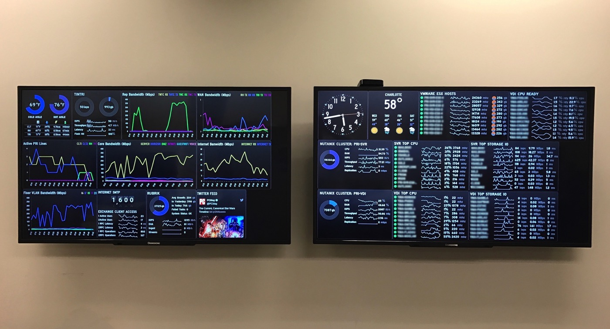
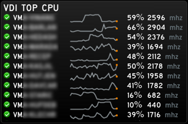
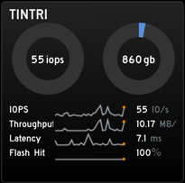

SysAdminBoard
=======================

SysAdminBoard is a collection of DIY panels and data generators for the [Panic StatusBoard iPad App](http://www.panic.com/statusboard/) designed to display data relevant to Sysadmins.  Code is written in Python, HTML and Javascript and served on a simple [CherryPy Webserver](http://cherrypy.org/) (included).

(New) Originally this code was intended only for use on the iPad app, but I had some stability problems that forced me to restart the iPad at least once a day.  To work around this problem, I replaced our iPads with a couple ASUS Chromeboxes and modified the code to run as a simple web page. I've added new HTML pages to replicate the clock, twitter, weather and graph functionality of the iPad app.

This project is not intended to be a ready-to-deploy solution.  However, if you are comfortable with Python, you should be able to get this working without much effort.

Here are some location shots of our installation:




##Features
###VMware vSphere ESX Host Monitoring


This code will talk to a VMware vSphere vCenter server using VMware APIs to get data about ESX hosts.  Items are sorted based on top CPU usage over a 30 minute period.
###VMware vSphere VM Monitoring


This code will talk to a VMware vSphere vCenter server using VMware APIs to get data about the top ESX VMs.  Items are sorted based on top CPU usage over a 30 minute period.
###SNMP Network Monitoring


This code generates JSON data only that is consumed by the Statusboard iPad app's built in graph function.

(New) I've written an HTML page that will also display graph data using [Chartjs](http://chartjs.org/) (see the VNX Storage Pool IOPS screenshot below).

###SNMP Temperature Gadget


This code talks to a couple different APC devices to pull in temperature, humidity, voltage and runtime data.
###EMC VNX Monitoring


This code talks to an EMC VNX Reporting and Monitoring web server to pull down performance data.  There is probably a better way to do this, but I was in a hurry.


(New) There's a new storage pool IOPS gadget that can either feed data to the iPad app or use my graph HTML (chart.js) to display.

###Exchange Monitoring


This code monitors a Microsoft Exchange server to display SMTP message totals for the day along with RPC and latency information (per CAS server).  Note that this code requires my [pyPerfmon](https://github.com/flakshack/pyPerfmon) app running on each Exchange server to be monitored.

###Tintri Monitoring


This code monitors a Tintri hybrid storage device using REST API calls.

###Weather


This is a simple javascript-only weather gadget that pulls data from [OpenWeatherMap.org](http://openweathermap.org).  If you use this gadget, please sign up for a free APPID on that site and edit the source file to include your code.

###Clock


This is a great javascript-only clock from [YXKFW](http://www.yxkfw.com/?p=15718).


## Code Layout
Individual python files are designed to be run independently for testing.  You can run any of the python files directly and it will output data in JSON format.  (Personally, I recommend loading it up in the [PyCharm](http://www.jetbrains.com/pycharm/) debugger).  

You will need to edit the files to provide your server ip addresses or SNMP OIDs.  You should edit the credentials.py file to store usernames and passwords.  Although the python files are hidden behind the web server, the credentials are being stored in plain text, so be sure that you are using restricted accounts.  For example, a read-only VMware vSphere account is all we need.

The static HTML pages are loaded by the Statusboard iPad App which then uses AJAX to retrieve the JSON data. 

The main function here is the webserver.py. This launches the CherryPy webserver and loads each data generator into a separate thread.  To enable/disable a module, find the MODULES section and call create a SysAdminBoardModule object, specifying the module filename (without the .py).  For example:  SysAdminBoardModule('vmware_host')  will load the vmware_host.py file, setup the webserver URLs and the process callback thread.

If you browse to the webserver, it will now display a list of loaded modules with links to display the output appropriately (HTML and AJAX).  Note that the webserver loads on port 8080 by default unless you make the iptables changes below to redirect from port 80.

## Simple Linux Configuration
Here are some directions for a base CentOS Linux server install.

Install setuptools and pip
```
curl https://raw.githubusercontent.com/pypa/pip/master/contrib/get-pip.py | python -
```

Install required Python modules for the statusboard code.
```
pip install CherryPy
pip install -U pysphere
pip install mechanize
pip install mysql-connector-python
pip install importlib
pip install routes
```

Install pysnmp
```
yum groupinstall "Development Tools"
yum install python-devel
wget https://bitbucket.org/pypa/setuptools/raw/bootstrap/ez_setup.py 
python ez_setup.py 
easy_install pysnmp
```

Setup Service

There is a simple init.d script in the source init.d directory.  Copy the sysadminboard  file to /etc/init.d/sysadminboard on server.  Copy all of my files into /opt/sysadminboard, create a user and group called sbpython, change ownership of all files to sbpython.  (The Webserver process will run as sbpython).
```
chmod +x /etc/init.d/sysadminboard
chkconfig sysadminboard on
chown -R sbpython:sbpython /opt/sysadminboard
```

With the init file in place, you can run the following commands (and it will load on startup):
```
service sysadminboard start
service sysadminboard stop
service sysadminboard status
service sysadminboard restart
```

Add these rules to your firewall to redirect from port 8080 to port 80:
```
 iptables -A INPUT -p tcp --dport 80 -j ACCEPT 
 iptables -A INPUT -p tcp --dport 8080 -j ACCEPT 
# Redirect port 80 to port 8080
 iptables -t nat -A PREROUTING -p tcp -m tcp --dport 80 -j REDIRECT --to-ports 8080
```

## HTML-only version

Check out the dashboard.html file as an example of running the site without an iPad.


##To Do
Here's a quick list of improvements I'd like to make to the system when I have time.
* Replace static HTML code with Templating system (Mako, Genshi or something else).  *Currently HTML tables are manually edited to match the expected output*


##Change Log
2015-02-08
* New HTML pages to graph data normally handled by Statusboard iPad app using Chartjs.
* Updated HTML to use a shared CSS file.
* Updated HTML to move to jquery 2.
* New VNX Storage Pool IOPS data generator.
* New HTML weather gadget.
* New HTML clock gadget.
* New HTML twitter gadget.
* New Dashboard.html file that will load other pages in an iFrame.
* Updated javascript error handling. Other minor javascript tweaks.


2014-09-09
* Credentials are now stored in a single file.
* Webserver.py has been simplified to avoid repeated code.  
	* Modules are now enabled/disabled by a single line: *SysAdminBoardModule('somemodulename')* which automatically imports the python file, adds the necessary entries to the webserver and sets up the process threads.  
	* .HTML files have been renamed to match the associated .PY module.  
	* URLs have also changed to match the module name.  http://server/module and http://server/module/ajax
	* Note that these changes require 2 new python modules (shown above: importlib and routes)
* Browsing to the root of the web site now displays links for all loaded modules (HTML and AJAX).
* A new sample module is included and is the only module enabled by default.
* New Tintri (REST API) monitoring gadget.
* Fixed HTML error handling (so pages will appear blank when the server is not responsive).
* HTML javascript updated to avoid hardcoded servername references.


##Links to Projects used here
* [JQuery](http://jquery.com/)
* [JQueryUI](http://jqueryui.com/)
* [Easy Pie Chart](http://rendro.github.io/easy-pie-chart/)
* [jQuery Sparklines](http://omnipotent.net/jquery.sparkline/#s-about)
* [PySNMP](http://pysnmp.sourceforge.net)
* [PySphere](https://code.google.com/p/pysphere/)
* [CherryPy](http://www.cherrypy.org/)
* [Flipcounter.js](http://cnanney.com/journal/code/apple-style-counter-revisited/)
* [YXKFW Apple HTML 5 clock](http://www.yxkfw.com/?p=15718)
* [OpenWeatherMap.org](http://openweathermap.org)
* [ChartJS](http://chartjs.org/)


